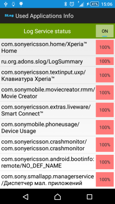
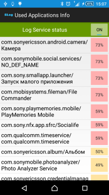
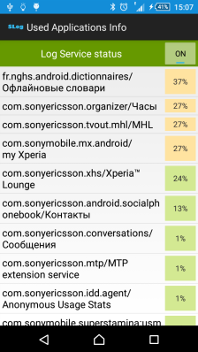
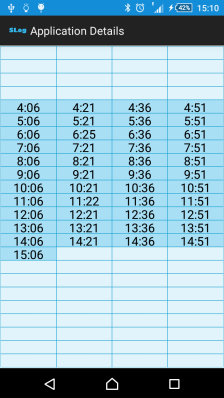

# Android-SLog
#### Android active applications info.

Scheduler Service stores info about all active applications and processes every 15 min for one day:

  

Summary info displays package name, application name, time (when application was detected by Service) and how many times (in percent) the process was detected:

